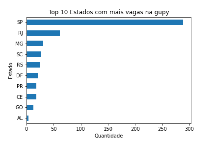
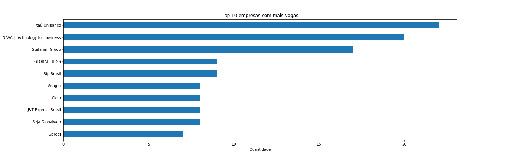

### Análise de Vagas de Dados na Plataforma Gupy

Nesta análise, explorei um conjunto de 587 vagas disponíveis na plataforma Gupy, todas relacionadas à área de dados. Os dados foram obtidos por meio de web scraping feito na data (28/08/2023), por meio deste arquivo. [Web Scraping](https://github.com/DanilloSouza03/Analise-Dados-Gupy/blob/main/getData.py)

#### Distribuição de Vagas por Estado

Ao analisar os **10 estados com o maior número de vagas**, constatamos que a região Sudeste domina as ofertas de emprego, com São Paulo liderando, seguido por Rio de Janeiro e Minas Gerais. 

  

#### Tipos de Contratos Mais Comuns

Em uma base de 587 vagas, notamos que mais de **400 delas são para cargos efetivos**, isso sinaliza uma alta demanda  por **profissionais qualificados e de longo prazo.** Além disso, identificamos um grande número de vagas com contratos de **Banco de Talentos e Estágio**, indicando que as empresas estão investindo em **novos talentos e em formar equipes diversificadas.**

  

#### Vagas para Pessoas com Deficiência (PcD)

Do total de vagas analisadas, **77,3%** são direcionadas a pessoas com deficiência. É importante mencionar que os 22,7% restantes têm dados não informados, o que pode indicar uma oportunidade para melhorar a coleta de informações nessa área. 

  

Entre as vagas remotas, 82% também oferecem oportunidades para PcD, demonstrando um esforço para deixar mais acessiviel.

  

#### Modalidade de Trabalho

Com relação à modalidade de trabalho, 67,8% das vagas são presenciais e 32,2% são remotas. Essa distribuição revela a preferência das empresas por terem colaboradores que possam estar presentes fisicamente em seus locais de trabalho.

  

#### Top 10 Empresas com Mais Oportunidades

Ao analisar as empresas com mais vagas, o **Itaú** lidera, seguido por **NAVA** e **Stefanini**. Essas empresas demonstram um compromisso contínuo em oferecer oportunidades na área de dados.

  

#### Top 10 Cidades com Mais Vagas Presenciais

São Paulo e Rio de Janeiro surgem como as principais cidades com vagas presenciais, refletindo o cenário econômico e populacional dessas regiões. Observamos que há uma porção significativa de dados não informados, sugerindo a importância de melhorias no preenchimento de informações por parte das empresas e/ou plataforma.

  

Esta análise oferece insights valiosos para candidatos em busca de oportunidades de emprego e empresas que desejam entender as tendências do mercado.

